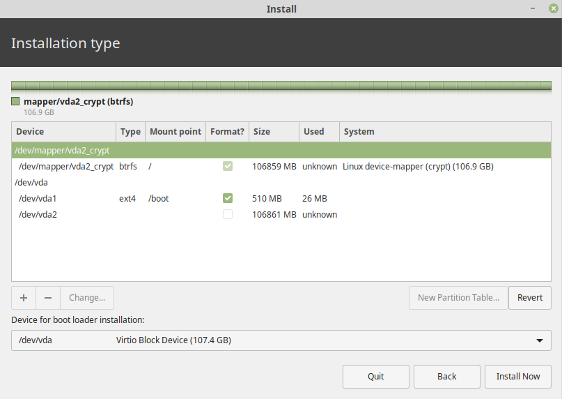

# Linux Mint 19.1 Installation Checklist

## Pre Install
Backup your Data, don't forget the following:
* SSH Key's in `~/.ssh/`
* PGP Key's (`gpg export`)
* Mozilla Thunderbird/Firefox, Google Chrome profiles (if you do this, you don't have to reconfigurate everthing like E-Mails, Addons, ...)
* Remmina Configs (`~/.local/share/remmina`)

## Installation

  

  

## Post Install
* Software Sources - change to the best performing repository servers
    

---

* Execute the scripts you want

---

* Nemo (Edit/Preferences):
  

  

  

  Press CTRL + L one time to make the URL bar editable. It shouln't look like this:
  

  This is what it should look like:  
  

---

* Date and Time  

* Mouse and Touchpad (only if the device has a touchpad)

* Desktop  

* Applets  
  * Install and add: CPU Temperatur Indicator

* Sound  
  * Disable all system sounds (e. g. starting cinnamon) or turn volume down to 0 %

* Printers  
  * Add your printers

* Preferred Applications  

* Startup Applications  

---

* If you encrypted your home directory, don't forget to save the output of `ecryptfs-unwrap-passphrase` on a save place.
