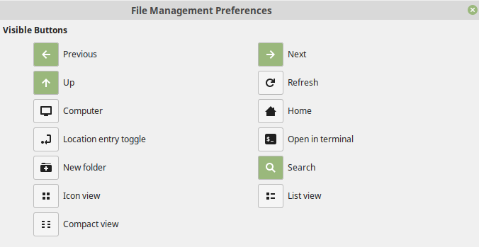

# Linux Mint 19.1 Installation Checklist

## Pre Install
Backup your Data, don't forget the following:
* SSH Key's in `~/.ssh/`
* PGP Key's (`gpg export`)
* Mozilla Thunderbird/Firefox, Google Chrome profiles (if you do this, you don't have to reconfigurate everthing like E-Mails, Addons, ...)
* Remmina Configs (`~/.local/share/remmina`)

## Post Install
* Software Sources - change to the best performing repository servers
* Execute the scripts you want

* Nemo (Edit/Preferences):
  * View new folders using: List View
  * Configure Toolbar
  
  * Press CTRL + L one time to make the URL bar editable

* System Settings
  * Date and Time
  * Mouse and Touchpad
  * Desktop
  * Applets
  * Sound
  * Printers
  * Preferred Applications
  * Startup Applications

* If you encrypted your home directory, don't forget to save the output of `ecryptfs-unwrap-passphrase` on a save place.
