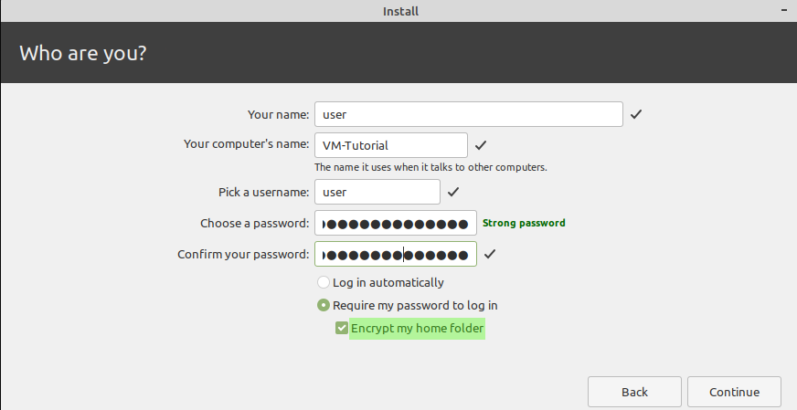

# Linux Mint 20 Installation Checklist

## Pre Install
Backup your Data, don't forget the following:
* SSH Keypair and Configuration in `~/.ssh/`
* PGP Key's (`gpg export`)
* Evolution Profile (Files -> Back up Evolution Data)
* Remmina Configs (`~/.local/share/remmina`)

## Installation

The installation is really straight forward. I suggest installing the third party software, encrypt the whole system and the home directory for an extra layer of security.

## Post Install
After the installation is completed and the system rebooted, you should first change the apt repository server to the best performing ones. You can do this using the **Software Sources** gui or by changing the apt config files in `/etc/apt/sources.list.d/`.
  

Now you can install the software you need on your system.

I personally like to change a few settings in the file explorer **Nemo (Edit/Preferences)**.  

Press CTRL + L one time to make the URL bar editable. It shouln't look like this:

This is what it should look like:  

Make sure your **Date and Time** settings work for you. By default the first day of the week is sunday and the date won't be displayed in the calendar applet.  

If you are on a notebook make sure to change the **Mouse and Touchpad** settings. (e.g. horiziontal or vertical scrolling)

I like to have a clean desktop, so I only add the trash bin.

I also like to see some system stats in my panel, so I always install the applet: CPU Temperatur Indicator

As you probably heard while the system was booting it make some sounds. I don't like those so I disable all system sounds.

After I added my printers, configured my preferred and startup applications I extract the passphrase for my ecryptfs encrypted home directory (`ecryptfs-unwrap-passphrase`) and save it in my password manager.

